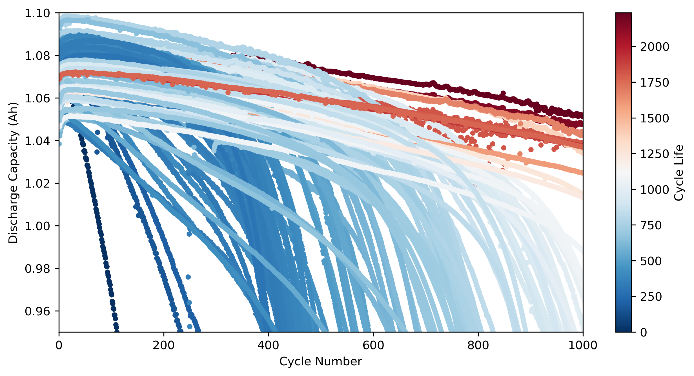
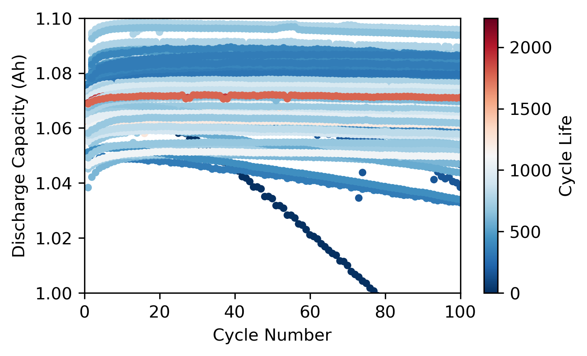
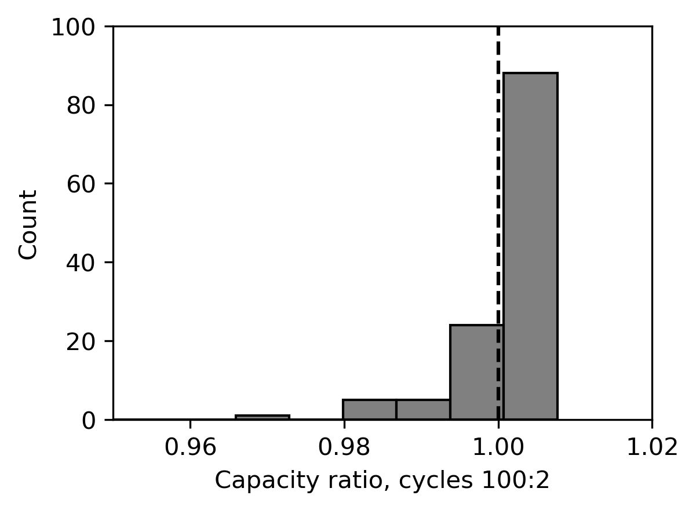
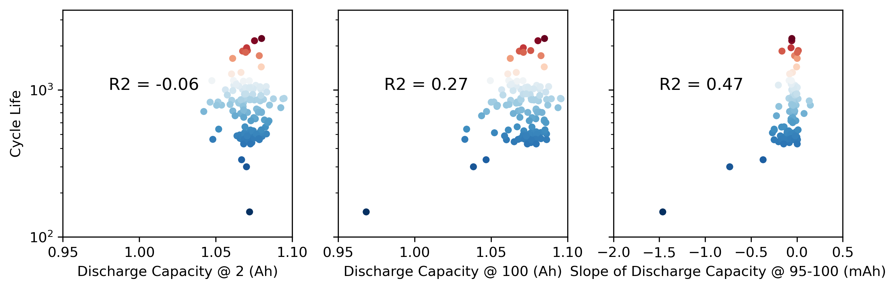
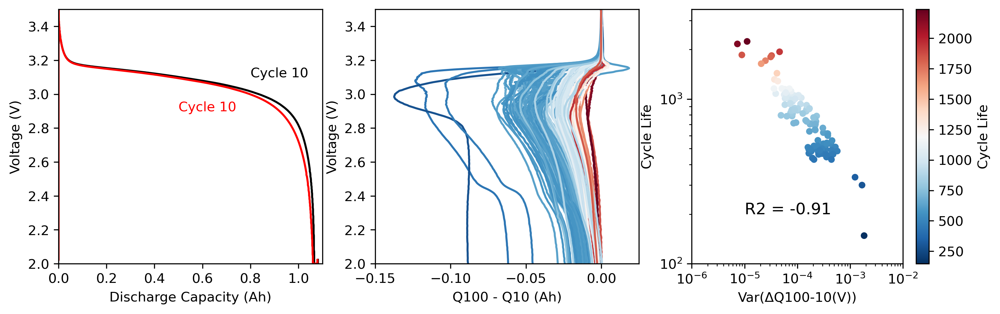
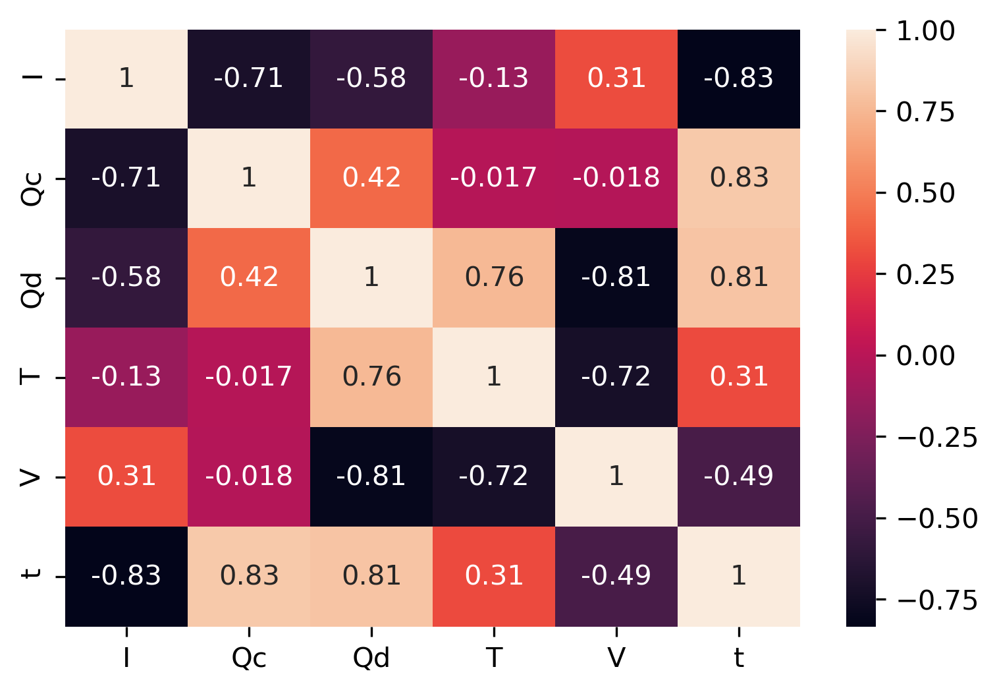
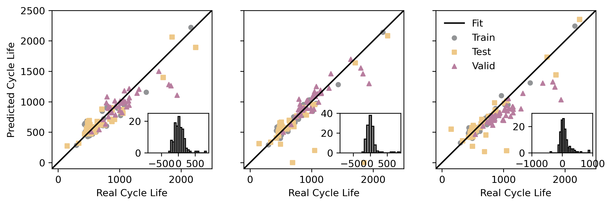

# 锂电池循环寿命早期预测 — Severson et al. (Nature Energy 2019) 复现

本项目复现 *Severson et al.*「Data-driven prediction of battery cycle life before capacity degradation」一文中的**部分内容**：从原始 `.mat` 数据构建、特征工程，到基于弹性网（ElasticNet）的循环寿命**回归**模型与寿命长短**分类**模型，并复现文章核心结果图。

> 核心思想：仅用电池**前 100 圈**循环数据提取特征（尤其 ΔQ₁₀₀₋₁₀(V) 的方差），即可在容量明显衰减前预测其循环寿命。

---

## 📄 原文与数据

| 项目 | 内容 |
|---|---|
| 论文 | *Data-driven prediction of battery cycle life before capacity degradation* |
| 作者 | K. A. Severson, P. M. Attia, N. Jin, et al. |
| 期刊 | **Nature Energy** 4, 383–391 (2019) |
| DOI | [10.1038/s41560-019-0356-8](https://www.nature.com/articles/s41560-019-0356-8) |
| 数据集 | 124 块 LFP 电池，3 个 batch 的快充循环实验数据 |
| 数据下载 | [https://data.matr.io/1/](https://data.matr.io/1/)（⚠️ **原始 `.mat` 需读者自行下载**，本仓库不含） |
| 官方实现 | [github.com/rdbraatz/data-driven-prediction-of-battery-cycle-life-before-capacity-degradation](https://github.com/rdbraatz/data-driven-prediction-of-battery-cycle-life-before-capacity-degradation)（可与本仓库对照参考） |

---

## 🗂 目录结构

```
nature_energy/
├── datasets/                     # 数据构建：.mat -> .pkl
│   ├── BuildPkl_Batch1.py        # batch1（2017-05-12）
│   ├── BuildPkl_Batch2.py        # batch2（2017-06-30）
│   └── BuildPkl_Batch3.py        # batch3（2018-04-12）
├── explore/                      # 探索与建模（按编号顺序运行）
│   ├── 01_load_data.py           # 数据清洗/合并/划分 + fig1 系列分析
│   ├── 02_feature_selection.py   # 特征工程 -> rebuild_features.{pkl,csv}
│   ├── 03_ML_model.py            # ElasticNet 三模型 + 逻辑分类 -> fig3 + 结果csv
│   ├── rebuild_features.csv      # 特征表（02 产物，已留痕）
│   ├── ElasticNet_reults.csv     # 三模型 RMSE/MPE 结果（03 产物）
│   └── classifier_reults.csv     # 分类模型准确率（03 产物）
├── results/                      # 结果图（README 展示用）
│   ├── fig1a.png … fig1d.png
│   ├── fig2.png  fig2b.png
│   └── fig3.png
├── requirements.txt
├── LICENSE
└── README.md
```

原始 `.mat` 与所有 `.pkl` 中间产物体积大、可由脚本重新生成，已通过 `.gitignore` 排除，**不纳入仓库**。

---

## 🔧 环境与依赖

> ⚠️ **h5py 版本关键**：`datasets/BuildPkl_Batch*.py` 使用 `Dataset.value` 读取数据，该 API 在 **h5py 3.0 已被移除**，必须锁定 `h5py < 3.0`。推荐 **Python 3.6–3.7 + h5py 2.10.x**。

```bash
pip install -r requirements.txt
```

主要依赖：`h5py(<3.0)`、`numpy`、`scipy`、`pandas`、`scikit-learn`、`matplotlib`、`seaborn`、`ipywidgets`。

---

## ▶️ 复现步骤

### 1. 下载并放置原始数据
从 [data.matr.io/1](https://data.matr.io/1/) 下载三个 `.mat` 文件，然后**修改 `datasets/BuildPkl_Batch*.py` 中的 `matFilename` 路径**，指向你本地的文件。

### 2. 构建 pickle 数据（需在 `datasets/` 下运行）
```bash
cd datasets
python BuildPkl_Batch1.py   # -> batch1.pkl
python BuildPkl_Batch2.py   # -> batch2.pkl
python BuildPkl_Batch3.py   # -> batch3.pkl
```

### 3. 探索 + 建模（需在 `explore/` 下运行）
```bash
cd ../explore
# 修改 01_load_data.py 中三个 batch*.pkl 的绝对路径后运行
python 01_load_data.py        # 清洗/合并 batch、划分 train/test/valid，生成 fig1 系列
python 02_feature_selection.py# 生成特征表 rebuild_features.{pkl,csv}
python 03_ML_model.py         # 训练三套 ElasticNet 回归 + 逻辑分类，生成 fig3 与结果 csv
```

> ⚠️ 脚本中存在硬编码的本地绝对路径（`E:\inc\...`），移植到新环境前需先按上述说明改路径，再运行。

---

## 📊 结果展示（fig1 → fig2 → fig3）

### Fig 1. 数据集概览与单变量特征（对应原文 Fig 1a–c, 1f）

**fig1a** — 全寿命放电容量衰减曲线（散点颜色 = 循环寿命）。容量在大部分寿命期内近似平台，末尾骤降。


**fig1b** — 前 100 圈放电容量。早期容量差异微小，肉眼几乎无法区分长寿命与短寿命电池——这正是早期预测的挑战所在。


**fig1c** — 第 100 圈与第 2 圈放电容量比（100:2）的分布直方图。


**fig1d** — 单变量与循环寿命的相关性：放电容量@2 / @100 / 95–100 圈容量斜率（对数纵轴）。


---

### Fig 2. 关键特征 ΔQ₁₀₀₋₁₀(V) 分析（对应原文 Fig 1d–e）

**fig2** — 左：第 10/100 圈放电曲线（V–Q）；中：所有电池 ΔQ₁₀₀₋₁₀(V) 在电压域的分布云图（颜色=寿命）；右：Var(ΔQ₁₀₀₋₁₀(V)) 与循环寿命呈强负相关——**这是文章提出的判别性最强、可单独用于预测的单特征**。


**fig2b** — 补充探索：单圈内各物理量（I/Qc/Qd/T/V/t）的相关系数热力图，用于特征冗余分析。


---

### Fig 3. 寿命预测模型表现（对应原文 Fig 2，parity plot）

预测循环寿命 vs 真实循环寿命。左→右依次为 **Variance model / Discharge model / Full model**；点形/颜色区分 train / test / valid，子图内嵌预测误差直方图。三个模型的 RMSE / MPE 指标见 `explore/ElasticNet_reults.csv`。


---

## 📈 模型与指标

- **回归（ElasticNet + 4 折 GridSearchCV，目标取 log10）**
  - *Variance model*：仅用 `Var(ΔQ₁₀₀₋₁₀(V))` 单特征；
  - *Discharge model*：加入 ΔQ 与放电容量相关特征；
  - *Full model*：再并入充电时间、内阻变化等特征。
  - 指标：RMSE（cycles）、MPE（%），按 train / primary test / secondary test 三个划分汇总，见 `explore/ElasticNet_reults.csv`。
- **分类（Logistic Regression）**：以循环寿命 ≥ 550 为标签，预测"长/短寿命"，准确率见 `explore/classifier_reults.csv`。
- 数据划分沿用原文：batch1+batch2 按奇偶分 train/primary test，batch3 作为 secondary test。

---

## ⚠️ 注意事项

1. **路径硬编码**：多个脚本含 `E:\inc\...` 绝对路径，迁移时需先改路径。
2. **h5py 版本**：须 `< 3.0`（见"环境与依赖"）。
3. **R² 标注**：`01_load_data.py` / `03_ML_model.py` 图中标注的 "R2" 实为标准化后的**线性回归系数**（可正可负，如 -0.91），并非决定系数 R²，解读时请注意。
4. 结果文件名 `*_reults.csv` 沿用脚本既有拼写，未作修正，以保持与脚本输出的对照。

---

## 📌 引用

若本仓库对你的工作有帮助，请引用原始论文：

```bibtex
@article{severson2019data,
  title={Data-driven prediction of battery cycle life before capacity degradation},
  author={Severson, K. A. and Attia, P. M. and Jin, N. and Perkins, N. and Jiang, B. and Yang, Z. and Chen, M. H. and Aykol, M. and Herring, P. K. and Fraggedakis, D. and Bazant, M. Z. and Harris, S. J. and Chueh, W. C. and Braatz, R. D.},
  journal={Nature Energy},
  volume={4},
  pages={383--391},
  year={2019},
  doi={10.1038/s41560-019-0356-8}
}
```

---

## 📄 License

本仓库代码采用 **MIT License**（Copyright © 2024–2026 Liu Yang）。

所用**数据集版权归 Severson et al. / Toyota Research Institute / data.matr.io 所有**，请从 [data.matr.io/1](https://data.matr.io/1/) 获取并遵守其数据使用条款。本复现仅供学习与研究用途。
